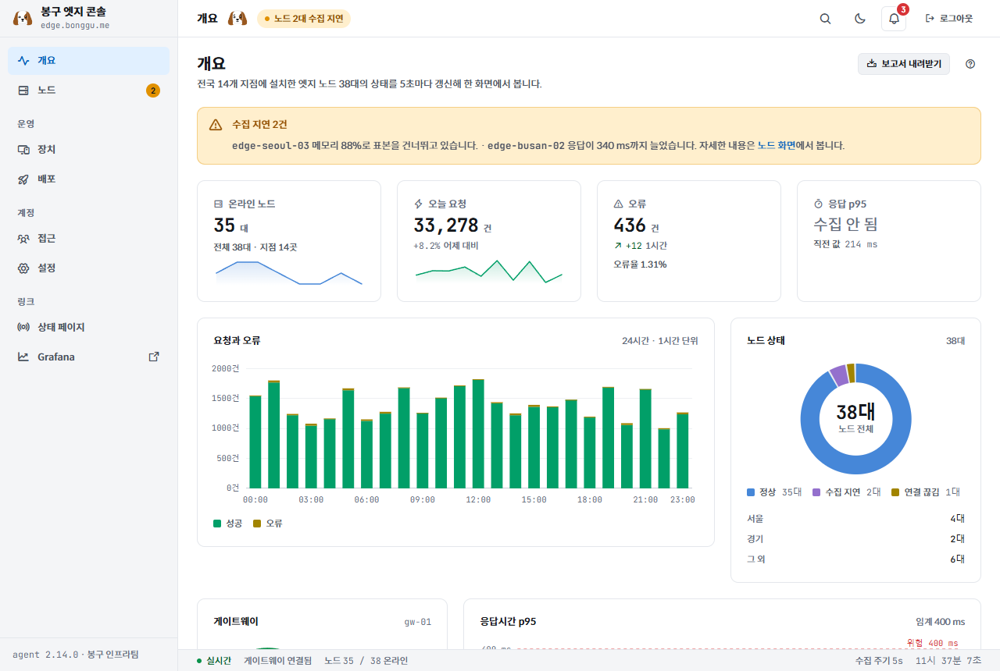
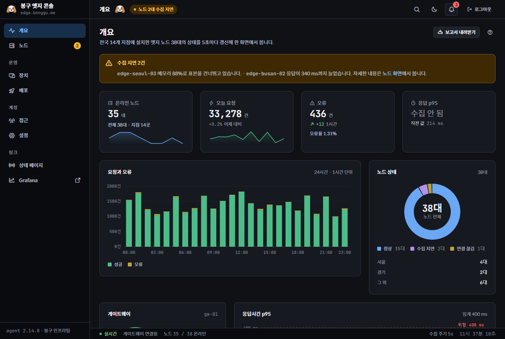
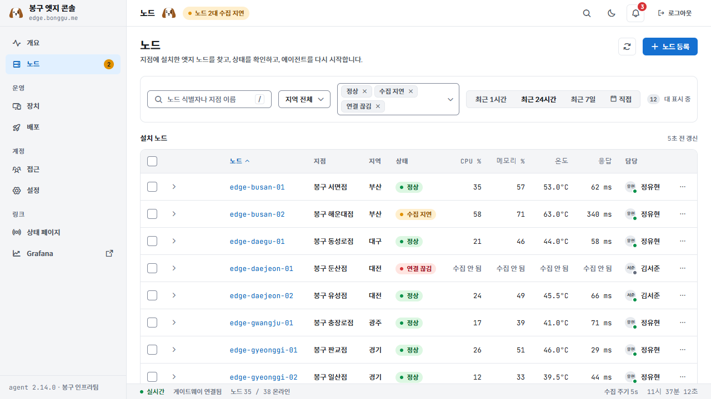
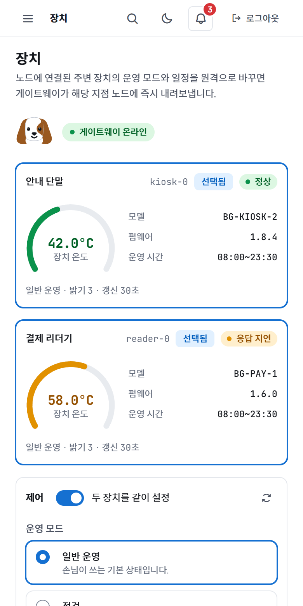

# Bonggu Dashboard Design System

[한국어 README](README_KO.md)

[](https://www.npmjs.com/package/@dbwk10317/bonggu-design-system)
[](https://github.com/dbwk10317/bonggu-design-system/actions/workflows/ci.yml)
[](LICENSE)

A React design system for operations and monitoring dashboards: screens full of live numbers, device controls, and statuses that change every few seconds. One set of tokens and components renders the same way in light and dark, on desktop, tablet, and phone.

- 96 components in 9 groups, one `Chart` component with 7 chart kinds
- Light and dark themes from the same token names, plus a compact density
- Missing data is a first-class state ("not collected"), never drawn as zero
- Native `<dialog>` and Popover API for overlays, keyboard navigation and live regions built in
- Container-query based responsiveness with a single `fit` sizing contract
- Korean-first copy and typography (Spoqa Han Sans Neo + JetBrains Mono, self-hosted)
- React 18.2 to 19, ESM, TypeScript declarations, MIT

## Screens

The screens below come from the sample app in [`templates/dashboard`](templates/dashboard), built only with this system's components.

| Overview, light | Overview, dark |
|---|---|
|  |  |

| Node list with filters and a data table | Device control on a phone |
|---|---|
|  |  |

## Install

```bash
npm install @dbwk10317/bonggu-design-system
```

`react` is a peer dependency (`>=18.2.0 <20`). The verification gate runs against React 18.3.1 and 19.3.0.

## Quick start

```tsx
import { ToastProvider, Panel, StatTile, Button, useToast } from "@dbwk10317/bonggu-design-system";
import "@dbwk10317/bonggu-design-system/styles.css";

function SaveButton() {
  const { toast } = useToast();
  return <Button variant="primary" onClick={() => toast({ message: "저장 완료", tone: "ok" })}>저장</Button>;
}

export function App() {
  return (
    <ToastProvider>
      <Panel caption="Online nodes">
        <StatTile label="Online" value={35} unit="nodes" detail="38 total · 14 sites" />
        <SaveButton />
      </Panel>
    </ToastProvider>
  );
}
```

- **Theme**: light is the default. Add the `dark` class or `data-theme="dark"` to `<html>` for dark.
- **Density**: add `data-density="compact"` to `<html>` for tables and consoles. Text sizes stay the same, spacing and control heights shrink. Touch devices keep 44px controls either way.
- **Styles**: `styles.css` is a single full-app entry that loads tokens, fonts, icons, and component styles. The element reset lives in `@layer bds-reset`, so any rule your app writes for `body`, `a`, `ul`, and so on wins over it.
- **Assets**: `@dbwk10317/bonggu-design-system/assets/mascot-neutral.svg` and `assets/favicon.svg` are exported. Fonts and icons are relative to the CSS and need no CDN.

## What's inside

| Group | Components |
|---|---|
| action | Button, IconButton, Icon |
| brand | MascotMark |
| layout | PageStack, PageHeader, Panel, CardHead, Toolbar, Grid, StatusBar, Container, Stack, Inline, Spacer, Divider, AspectRatio, Visible |
| navigation | SidebarShell, TopNav, Tabs, Breadcrumb, Pagination, Link, CommandPalette |
| input | Field, TextField, TextArea, Select, Checkbox, RadioGroup, Switch, SearchField, SegmentedControl, Slider, NumberStepper, ColorInput, Combobox, MultiSelect, DatePicker, DateRangePicker, TimePicker, PasswordField, OTPInput, CodeEditor, Dropzone, FileUpload |
| data | Chart (line, area, bar, pie, radial, radar, histogram), Sparkline, Gauge, Heatmap, StatTile, TrendDelta, BarList, KeyValues, DescriptionList, DataTable, LogViewer, Timeline, DiffView, Legend, UptimeBar |
| display | StatusPill, Tag, Badge, Avatar, Accordion, Code, CodeBlock, Kbd, CopyField |
| overlay | Modal, FormModal, Drawer, Popover, Tooltip, DropdownMenu |
| feedback | AlertBanner, Toast, NotificationDrawer, InlineMessage, ProgressBar, Stepper, Skeleton, Spinner, LoadingOverlay, EmptyState, ErrorState, ConfirmDialog |

Every input component forwards its `ref` to the underlying control, so form libraries and programmatic focus work as expected. Each component ships with a `.d.ts` and a short usage note (`components/<group>/<Name>.prompt.md`).

## Static HTML and prototypes

The same source builds a browser bundle (`_ds_bundle.js`, exposed as `window.Ds_d3ea90`) for throwaway mocks and the guide pages. Load React UMD, the bundle, and `styles.css`; see any `components/*/*.card.html` for the pattern.

## Documentation

- [RULE.md](RULE.md) (Korean): the design rules. Tokens, copy, accessibility and behavior contracts, the public API and versioning contract, and the release procedure. This is the single source of truth; machine-checkable rules are enforced by `tests/rule-regressions.cjs`.
- [Guide](guidelines/index.html): every component and token card, viewable at the three review widths. Serve the repository root (`python -m http.server 8080`) and open `http://localhost:8080/guidelines/index.html`.
- [Sample app](templates/dashboard/README.md): a clickable edge-fleet console with six screens and a public status page.
- [AGENTS.md](AGENTS.md): how changes are made in this repository. [tests/README.md](tests/README.md): what the verification gate covers.
- [CHANGELOG.md](CHANGELOG.md)

## Browser support

Verified in Chromium. The components rely on the Popover API, native `<dialog>`, container queries, `oklch()`, and `:has()`, which correspond to Chrome/Edge 114+, Safari 17+, and Firefox 125+. Safari and Firefox are not yet part of the automated gate.

## Versioning and releases

SemVer. Changes are recorded with Changesets, and a `v*` tag publishes to npm through GitHub Actions with Trusted Publishing and a signed provenance statement. Patch releases keep the public contract, minor releases add, major releases rename or remove (with a migration table, never an alias).

## License

MIT. Spoqa Han Sans Neo, JetBrains Mono, and Phosphor Icons are included under their own licenses; see [THIRD_PARTY_NOTICES.md](THIRD_PARTY_NOTICES.md).
